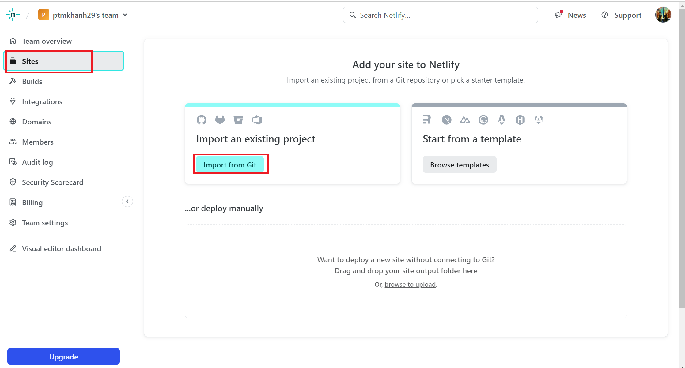
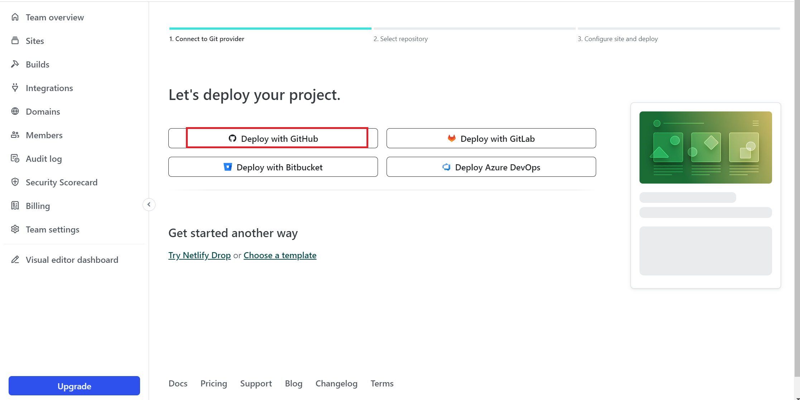
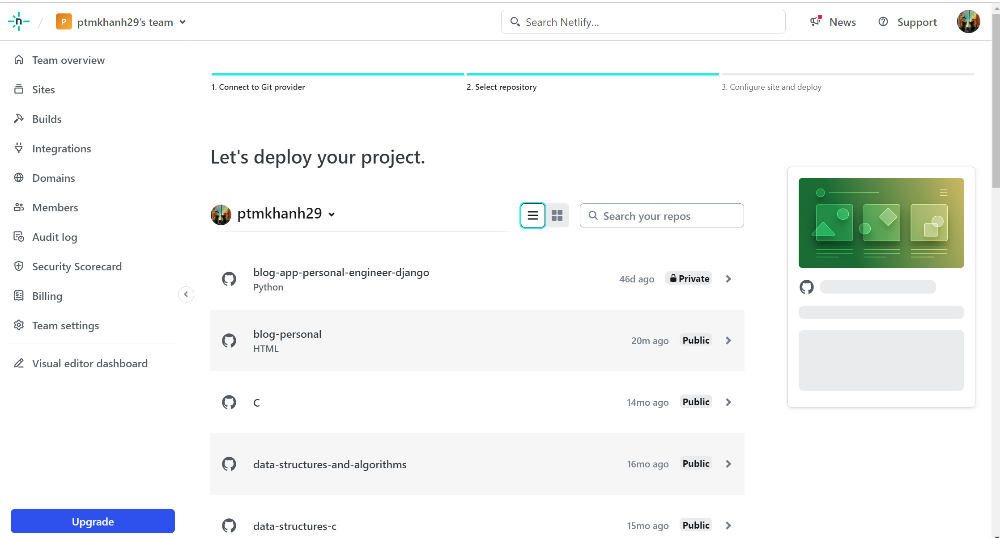
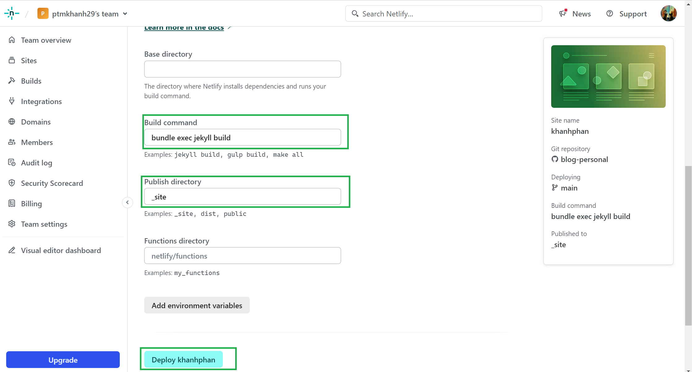
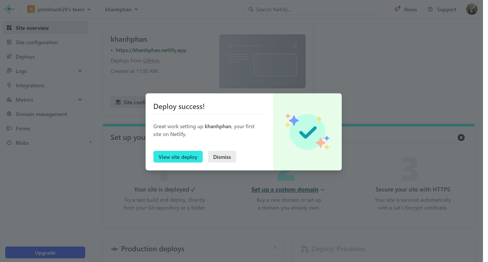
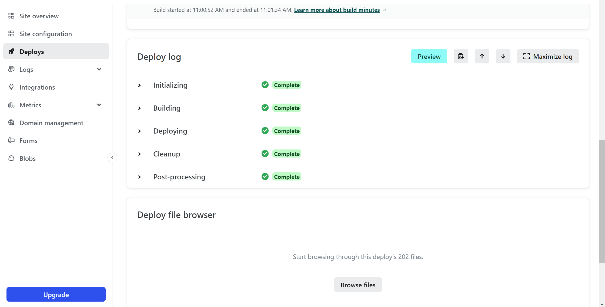

## Contribution

Hey there, fellow developer !!!... I'm happy to see you intrested in contributing to this open source project. Since, this project is an open notebook for everyone, you're always welcome to make your techinal writing contribution by writing you own blog, tip & trick, documentation and much more. All you have to do is write down your content in `markdown` *(just like how wrote this README.md file)* and place those file within `_posts` directory. 

> First time ???... Then I highly recommend you to check out [CONTRIBUTING.md](CONTRIBUTING.md "goto CONTRIBUTING.md").

- **Step 1:** Make sure you install the required dependencies like `Ruby`, `bundler` and `Jekyll` framework. Installation varies from platform to platform, so make sure to check out the [CONTRIBUTING.md](CONTRIBUTING.md "goto CONTRIBUTING.md").

- **Step 2:** After installing the required dependencies, [fork](https://github.com/Grow-with-Open-Source/Notebook/fork "Let's fork this repo") this repository and clone it in your local system, using the following command:
```bash
git clone https://github.com/<your-github-profile>/Notebook.git
```

- **Step 3:** Build and run the project within your local machine.
```bash
# installing required dependencies for the project to run
bundle

# host the build within your local machine
bundler exec jekyll s
```

> [!NOTE]
> If project build is successful, then you can view the project build that is hosted through your [localhost:4000/Notebook](http://127.0.0.1:4000/Notebook/). Well done, you have successfully setted up the project within your local system.

- **Step 4:** After you have setted up the project and done analyzing it, Create a new branch to work on. Make sure your branch name is small and simple.
```bash
# create and checkout to your new branch
git checkout -b <your-post-name>

# checking which branch you currently in
git branch
```

- **Step 5:** Now, go ahead and enter your author details within the [`authors.yml`](_data/authors.yml) even before you started working on your technical writing. Just make sure you're entering the details in the following format:
```yml
# Make sure the key value does not match other authors
unique_key_value:
  name: <author_name>
  twitter: <twitter_id>
  url: <personal (or) contact url>
```

<details>
<summary>Looking for an example ?</summary>
<div>

```yml
shamith_watchdogs:
  name: Shamith Nakka
  twitter: Shamith29188225
  url: https://github.com/iamwatchdogs/
```

<div>
</details>


- **Step 6:** Now to the actual task, Create a new markdown file with `YYYY-MM_DD-your-post-name.md` *(make sure your post name is in small letters and separated by single dash)* within the [`_post`](/tree/main/_posts/) directory.

- **Step 7:** Each and every markdown file that you have created for content writing should contain the following meta data (or) config:
```md
 ---
  title: <title>
  date: YYYY-MM-DD HH:MM:SS +/-TTTT
  categories: [<main_categories>, <sub_categories_1>, ..., <sub_categories_n>]
  tags: [<tag_1>, ..., <tag_n>]
  author: <respective_author_key_value>
  img_path: "/assets/img/<your_img_directory_name>/"
  image:
    path: <name_of_the_img_for_page_cover>
    alt: <alternative_text>
  ---

  # Your content writing begins here
```

<details>
<summary>Looking for an example ?</summary>
<div>

```md
---
title: Welcome to the Notebook
date: 2023-09-21 20:34:00 +0530
categories: [Welcome, Guide]
tags: [introduction]
author: shamith_watchdogs
img_path: "/assets/img/welcome-page/"
image:
  path: "welcome-img.jpg"
  alt: "Welcome Page"
---

# remaining content down below
```

<div>
</details>

> [!NOTE] 
> - Note that the `+/-TTTT` in the `date` section refers the **UTC offset**. You can find your **UTC offset** value by searching for your country in the [list of UTC](https://en.wikipedia.org/wiki/List_of_UTC_offsets "Goto List of UTC offsets"). And if you're from India, you can use the above UTC offset from the example.
> - Also not that `img_path` and `image` *(including its sub attributes)* are optional and only need when you're going to add images to your post.
> - If there are more than one person working on a single post use `authors` attribute instead of `author`. And the input for the `authors` attribute will be a list of key of authors specified within the [`authors.yml`](_data/authors.yml) file.

- **Step 8:** Now, you can proceed to write your technical content. And if you have any images that are part of your technical writing, then create a new directory using your post's name within `assets/img` directory as `assets/img/<your-post-name>`. Now add your images to your folder. After adding images to your folder, don't forget to add location to `img_path` attribute as `img_path: ../../assets/img/<your-post-name>`. Now, you can directly access your images with specifying full relative path.

> [!NOTE] 
> It's highly suggested to use CDN links for images. But if you could not for any reason, then you can proceed with above process.

- **Step 9:** After you done with your changes, commit them and push them back to your forked repo.
```bash
# tracing new files and stagging new changes
git add .

# commiting your changes
git commit -m "Added <your-post-name>"

# check your branch name
git branch

# push your commits to your origin repo
git push origin <your-branch-name>
```

- **Step 10:** Now, create a pull request to the [original repo](https://github.com/Grow-with-Open-Source/Notebook). [Learn about Pull requests](https://docs.github.com/articles/using-pull-requests "offical GitHub documentaiton")

And that it, you have done it !!!... Now, it's time for the maintainer to review you work and merge you pull request. If there's any issue with your pull request, then the maintainer will contact you and asks for a few changes. And he merges your Pull request, you have successfully did your first open source contribution that actual help others.

Everybody can see you work and make use of it. Good job, mate !!...

## How to deploy to Netlify

You can deploy it to https://app.netlify.com

- **Step 1:** Now, you can login Netfiy with account Github

- **Step 2:** Add Your New Site: 

Once you log in to Netlify, you'll be taken to https://app.netlify.com/. From here, select 'Site' in sidebar, click 'Add new site', click 'Import an existing project':

<div align="center">



</div>

- **Step 3:** Link to Your GitHub

Select 'Deploy with GitHub' to link your repository.

<div align="center">



</div>

It's time to allow Netlify and GitHub to talk to each other. Clicking the "Authorize Application" button will do just that. Netlify doesn't store your GitHub access token on our servers. If you'd like to know more about the permissions Netlify requests and why we need them, you can visit https://www.netlify.com/docs/github-permissions/.

- **Step 4**: Choose Your Repo

Now that you've connected Netlify and GitHub, you can see a list of your Git repos. There's the "jekyll" repo you just pushed to GitHub. Let's select it.

<div align="center">



</div>

- **Step 5**: Configure Build Setting

Netlify will automatically try to detect the build settings. For a Jekyll project, you need to configure the following:

Build Command: enter `jekyll build` or `bundle exec jekyll build` if you use Bundler.

Publish directory: enter `_site/`, this is the directory that Jekyll creates after building (unless you have another custom configuration).

(Optional) You may need to set an environment variable, like JEKYLL_ENV=production if needed. (In my site, I skip this option).

And click **Deploy 'Your-site'**

<div align="center">



</div>

 - **Step 6**: Deploy succsee
 
<div align="center">



</div>

You can review the built steps in the **Deploy** tab

<div align="center">



</div>
